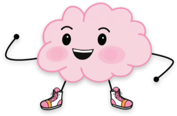
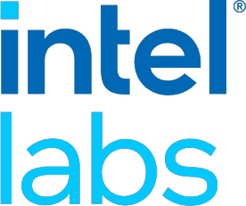

# Course overview and introduction

### PSYC 11: Laboratory in Psychological Science

Jeremy R. Manning
Dartmouth College
Spring 2026

---

# What is this course about?

- Learn to carry out psychological research **by doing it**
- Each lab maps to a section of a scientific article: Introduction, Methods, Results, Discussion
- First ~5 weeks: guided labs. Last ~5 weeks: your own study!

- How do we turn curiosity into a testable hypothesis?
- What makes evidence convincing (or misleading)?
- How do we communicate science clearly and honestly?

---

# Who am I?
<!-- _class: manual-layout -->

<h3 style="color: #001c12 !important; margin: 0;">Jeremy R. Manning, Ph.D.</h3>

Associate Professor | Psychological &amp; Brain Sciences |  | <a href="https://context-lab.com/scheduler">Moore 349</a>

<a href="https://www.context-lab.com" class="header-link"><u>context-lab.com</u></a>

<a href="https://github.com/ContextLab" class="header-link"><u>ContextLab</u></a>

<h4>Research focus</h4>

How do our brains support our ongoing conscious thoughts, and how (and what) do we remember?

<h4>Key areas</h4>

Learning and memory, education technology, brain network dynamics, data science, NLP

<h4>Approach</h4>

Theory, models, experiments, neuroimaging

<h4>Training</h4>

B.S., Neuroscience &amp; Computer Science

Ph.D., Neuroscience

Postdoc, Computer Science &amp; Neuroscience

<h4>Funding &amp; collaborators</h4>

---

<!-- _class: scale-90 -->

# Logistics (the short version)

- Course webpage: **[context-lab.com/experimental-psychology](https://context-lab.com/experimental-psychology/)**
- Communication via **[Slack](https://psyc11.slack.com)**
- Bring your laptop to every class
- Office hours: Tuesdays, sign up at [context-lab.com/scheduler](https://context-lab.com/scheduler)
- Full policies are in the **syllabus** -- read it!

Course webpage

Slack

---

# Teaching assistants

- **Yifan Fang**
- **Yuqi Zhang**
- **Eunhye Choe**

TAs will lead lab sections, hold office hours, and help with your projects. Don't hesitate to reach out!

---

# Discussion: What do you want to know?

- What is one question about human behavior or the mind that you find genuinely interesting?
- Share with a neighbor -- do your questions overlap? How are they different?

---

# Psychology of Everyday Life survey lab!

- Gentle introduction to asking questions in a **scientific** way
- You'll fill out a short survey about your everyday habits and attitudes (sleep, stress, screen time, happiness...)
- Then we'll use this data to practice formulating and testing hypotheses

- What's the difference between a "feeling" you have about people and a testable scientific claim?
- If you found that students who sleep more are happier, what would you *actually* have learned? What *wouldn't* you know?
- How would you design a study to distinguish "correlation" from "cause"?
- Can you think of a question about human behavior that *can't* be studied scientifically? Why not?

---

# Let's collect some data!

- Fill out the survey and review the lab instructions

Survey form

Lab instructions

---

# Questions? Want to chat more?

  

    &#x1F4E7;
    <a href="mailto:jeremy@dartmouth.edu">Email</a> me
  

  

    &#x1F4AC;
    Join our <a href="https://psyc11.slack.com">Slack</a>
  

  

    &#x1F481;
    Come to <a href="https://context-lab.com/scheduler">office hours</a>
  

- **Today**: collect data and form some hypotheses
- **Wednesday**: thinking about data analysis
- **X-hour and Friday**: I'll be away (no class). But we will use some of the X-hours to make up missed classes when I'll be traveling and for Memorial Day, including next week's X-hour.

