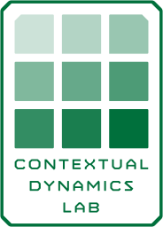

# Course overview and Introduction

### PSYC 11: Laboratory in Psychological Science

Jeremy R. Manning
Dartmouth College
Spring 2026

---

# What is this course about?

- Learn how to carry out psychological research
- Doing research vs. writing a (complete) scientific article

- **Introduction:** motivate your research question
- **Methods:** describe how you studied the question
- **Results:** describe what you found
- **Discussion:** situate your findings in the broader literature

---

# Why should you care about writing?

- Formulate your question and approach
- Share what you did and found
- Learn to read and critically evaluate other work

---

# Organization

- **First 5(ish) weeks:** in-class labs, each focused on teaching you about one section of scientific articles
- **Last 5(ish) weeks:** carry out your own research study
- **Goal:** leave this course with a deep understanding of how psychological research is "done"

---

# Logistics

- All materials, including assignments, readings, etc, are provided on the course **[GitHub page](https://github.com/ContextLab/experimental-psychology)**
- We'll use **[Slack](https://psyc11.slack.com)** to communicate, share materials and data, etc.
- You should bring your laptop to every class

---
<!-- _class: scale-90 -->

# Logistics

- I'll hold **office hours** by appointment on Mondays and Thursdays. Schedule through: [context-lab.youcanbook.me](https://context-lab.youcanbook.me) (or email me).

- If you post questions on Slack, I'll answer them (usually within 1-2 business days).
- If you have any comments, questions, concerns, etc., **please let me know** (via Slack DMs or email: [jeremy@dartmouth.edu](mailto:jeremy@dartmouth.edu)).

---

# Teaching assistants

- Sarah Kerns
- Yeongji Lee
- Zizhuang Miao

---

---

# Contextual Dynamics Lab

- Build brain models to understand how our brain structures interact during learning and memory
- Computational models, data science tools
- More info: [www.context-lab.com](https://www.context-lab.com)

---

# Psychology of Everyday Life survey lab!

- Gentle introduction to asking questions in a scientific way (aside: how is this different from a "regular" question?)
- How do you think your everyday habits (sleep, stress, screen time) compare to your classmates'?
- What patterns would you **expect** to see in how people rate their happiness, stress, and daily routines?
- What makes a "good" hypothesis vs. a "bad" hypothesis?

---

# Psychology of Everyday Life survey lab!

- Today's job: collect some data!

