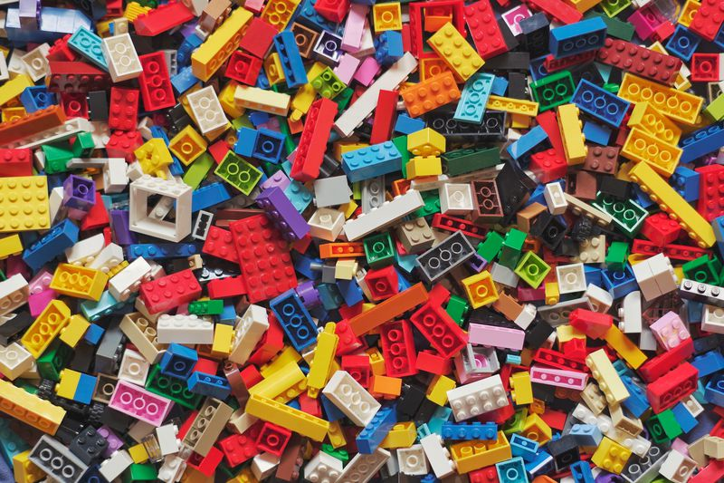

# <!-- fit --> Statistical building blocks

### PSYC 11: Laboratory in Psychological Science

Jeremy R. Manning · Dartmouth College · Spring 2026

---

# You already know how to *use* statistical tests

- Want to compare two group means? → t-test or ANOVA
- Want to see if two variables are related? → correlation or regression
- Want to test if categories are associated? → chi-square test
- ...etc.

Where do those tests actually **come from**?

---

# Today: learn to *make* your own statistical tests

Every statistical test is built from the same basic recipe:
1. Pick a **distribution** that matches your data type
2. Set parameters to represent your **null hypothesis**
3. **Simulate** many datasets from that null distribution
4. Compare your **actual data** to the simulations and ask how unusual it is

That's it. Every test you learned in intro stats follows this exact recipe!

---

# Discussion: what kind of data did we collect?

On Monday you reported: sleep hours, stress (1&mdash;10), happiness (1&mdash;10), screen time, exercise days, caffeine, study hours, social activity (1&mdash;10).

- Which of these are **real numbers** (could be any value)?
- Which are **counts** (integers only)?
- Which are **bounded ratings** (e.g., 1&mdash;10 scale)?

- Different types of data are generated by different **distributions**
- To build a test, you need to pick the right distribution for your data type
- This is the first step in the recipe for building a test!

---

<!-- _class: scale-80 -->

# Distributions: the building blocks

A distribution is a mathematical object that generates data. Different distributions produce different types of values.

| Distribution | Parameters | What you get out | Survey example |
|-|-|-|-|
| **Gaussian** | Mean, variance | Real numbers | Sleep hours |
| **Bernoulli** | Probability | 0 or 1 (coin flips) | "Do you exercise?" (yes/no) |
| **Binomial** | N trials, probability | Count of successes | How many days/week do you exercise? |
| **Uniform** | Start, end | Number in range | If ratings were random |

---

# So how do we *build* a test?

**Question**: "Do students who sleep more report less stress?"

1. **Pick a distribution**: If there's no relationship, stress scores for high-sleepers and low-sleepers should come from the **same** distribution
2. **Set null parameters**: Both groups have the same mean stress
3. **Simulate**: Randomly shuffle who's in which group 10,000 times, compute the mean difference each time
4. **Compare**: Is the *actual* difference between groups bigger than what we get from shuffling?

---

# Discussion: Design your own test

Pick one of your hypotheses from Monday. For that hypothesis:

- What **distribution** would your data come from if the null hypothesis were true?
- What would you **simulate** to build a null distribution?
- What **statistic** would you compute to compare your actual data to the simulations?

Don't worry about getting it "right" — we'll work through this together!

---

# Why does this matter?

- In intro stats, you pick from a menu of pre-made tests
- In real research, your question might not fit a standard test
- If you understand the **recipe**, you can build a test for *any* question
- This is also how modern computational statistics works: simulation-based testing

---

# Let's try it with our actual data

This notebook lets you explore the class survey data and try building your own simulation-based tests!

Survey analysis notebook (Google Colab)

---

# Questions? Want to chat more?

  

    &#x1F4E7;
    <a href="mailto:jeremy@dartmouth.edu">Email</a> me
  

  

    &#x1F4AC;
    Join our <a href="https://psyc11.slack.com">Slack</a>
  

  

    &#x1F481;
    Come to <a href="https://context-lab.com/scheduler">office hours</a>
  

- **Today**: start thinking about your hypotheses and analysis plan
- **Thursday and Friday**: no class this week (instructor away)
- **Next Monday**: Motivating your science + Pitch lab starts

