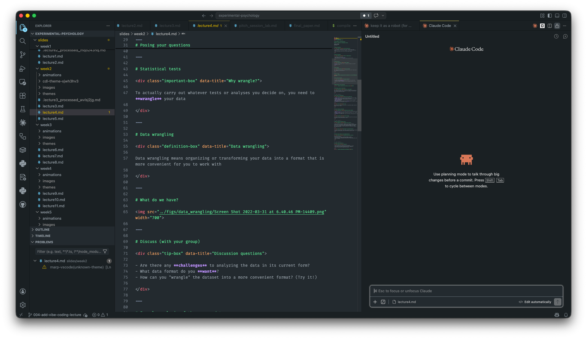
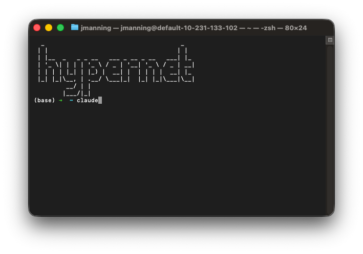
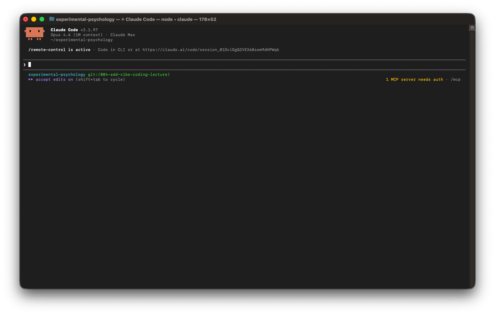

# Vibe coding tips and tricks
### PSYC 11: Laboratory in Psychological Science

Jeremy R. Manning
Dartmouth College
Spring 2026

---

# Today's agenda

<div class="definition-box" data-title="What is vibe coding?">

Vibe coding means using AI coding agents to rapidly prototype and implement software by describing what you want in natural language, then iterating on the output.

</div>

<div class="note-box" data-title="Topics">

1. Free AI coding tools for students
2. Setting up your environment: VS Code + Claude Code
3. The spec-kit workflow: from design docs to implementation
4. Live demo: build something together!

</div>

<div class="tip-box" data-title="Follow along!">

Install the tools (and try using them) as we go — and ask questions as they arise!

</div>

---
<!-- _class: scale-80 -->

# Free coding models

- **GitHub Copilot** (free for students): great at code completion, chat assistance
- **Google Gemini** (free for students): long context, reasoning-heavy tasks
- **Dartmouth GenAI** ([chat.dartmouth.edu](https://chat.dartmouth.edu)): free access to many models
- **Ollama** and **LM Studio**: run LLMs locally
- **Hugging Face**: open models, useful for integrating into projects

---
<!-- _class: scale-80 -->

# My favorite paid options

- **Anthropic Claude**: fantastic coding model (what I use most!)
- **OpenAI ChatGPT**: powerful, different feel; sometimes when one struggles the other helps

<div class="note-box" data-title="Student discounts">

Check for student discounts and free tiers — many AI providers offer generous free usage for students with a `.edu` email address.

</div>

---

# Setting up your environment

Two main options:

1. **IDE**: VS Code with Claude Code extension
2. **Terminal-based**: Claude Code CLI

<div class="note-box" data-title="Other options">

Claude Code also has a native desktop app. Some IDEs are designed specifically for AI coding (Cursor, Antigravity). Google Colab has built-in AI assistance too.

</div>

---

# Setting up VS Code



---

# Setting up VS Code (details)

- Download from [code.visualstudio.com](https://code.visualstudio.com)
- Install essential extensions: **Claude Code**, **GitHub Copilot**, **Jupyter**, **Python**
- Activate Copilot with your GitHub account

---

# Setting up Claude Code (in Terminal)

<div class="note-box" data-title="Install command">

```bash
npm install -g @anthropic-ai/claude-code
```

</div>



---

# Launch Claude Code



---

# Claude Code configuration

- Use `/model` to switch between models (Claude Sonnet, Opus, Haiku)
- Connect with your Anthropic account, or use GitHub Copilot models
- Claude Code runs in your terminal inside your project directory
- It can read files, write code, run commands, and browse the web

---
<!-- _class: scale-80 -->

# Initializing a project

<div class="note-box" data-title="Start here!">

Clone your repo and `cd` into it.

</div>

- Launch Claude Code (run `claude` inside the project folder)
- Claude Code automatically analyzes the codebase
- It maintains a `CLAUDE.md` file to help future sessions understand the project

---
<!-- _class: scale-80 -->

# The four-step vibe coding workflow

```
[Describe] --> [Design] --> [Plan] --> [Implement]
```

<div class="example-box" data-title="1. Detailed description">

Specify inputs/outputs, edge cases, and examples

</div>

<div class="note-box" data-title="2. Technical design doc">

Have AI draft the architecture, iterate on it, produce skeleton code

</div>

<div class="warning-box" data-title="3. Implementation plan">

Break into small tasks with verification steps; mind context limits

</div>

<div class="definition-box" data-title="4. Implement and verify">

Let AI write code, test each piece, stress test the final product

</div>

---

# The spec-kit workflow

<div class="definition-box" data-title="What is spec-kit?">

Instead of writing a technical design doc and implementation plan from scratch, you write a specification first. The spec becomes the executable source of truth.

</div>

<div class="example-box" data-title="The 6 steps">

1. **Constitution** — establish inviolable project principles
2. **Specify** — describe what you want built
3. **Clarify** — resolve ambiguities interactively
4. **Plan** — generate an architecture and design doc
5. **Tasks** — break the plan into ordered, actionable tasks
6. **Implement** — execute tasks with verification at each step

</div>

---
<!-- _class: scale-80 -->

# Writing a good spec

<div class="warning-box" data-title="The golden rule">

Focus on **WHAT** and **WHY**, not **HOW**.

</div>

<div class="example-box" data-title="Spec structure (user story format)">

```markdown
## User Story
As a [role], I want [feature] so that [benefit].

## Acceptance Criteria
- Given [context], when [action], then [result]
- Given [context], when [action], then [result]

## Constraints
- Must work on [platforms]
- Must handle [edge cases]
```

</div>

---

# Demo — Gamified Cognitive Testing Battery

<div class="note-box" data-title="What we're building">

A single HTML file that runs participants through a battery of quick gamified cognitive tests (Stroop, free recall, go/no-go, N-back, digit span, flanker, visual search, mental rotation) and displays a bar chart of performance with a class leaderboard.

</div>

<div class="tip-box" data-title="Real research!">

This is a real experiment you could run in a psychology course!

</div>

---

# The spec-kit workflow for our demo

```
[Constitution] --> [Specify] --> [Clarify] --> [Plan] --> [Tasks] --> [Implement]
```

<div class="note-box" data-title="Documents at each step">

Each step produces a document that becomes the source of truth.

</div>

<div class="important-box" data-title="Why this matters">

The spec-kit workflow keeps everything grounded in a clear, unambiguous specification.

</div>

---
<!-- _class: scale-80 -->

# Constitution

<div class="example-box" data-title="Prompt: /speckit.constitution">

```
Create a constitution for this project with these principles:
- Single HTML file (no build tools, no npm, no server)
- Vanilla JavaScript only (no frameworks)
- Modern CSS (flexbox, grid, CSS variables)
- All cognitive tasks must be self-contained
- Results stored in localStorage
- Leaderboard uses anonymous class codes
- Must work on mobile and desktop browsers
- Accessible design (WCAG 2.1 AA)
```

</div>

<div class="note-box" data-title="Output">

A `constitution.md` file with inviolable rules.

</div>

---
<!-- _class: scale-70 -->

# Specify

<div class="example-box" data-title="Prompt: /speckit.specify">

```
Build a gamified cognitive testing battery. Single HTML file.

User Journey:
1. Student enters their anonymous class code
2. Sees a menu of 8 cognitive tasks (Stroop, free recall, 
   go/no-go, N-back, digit span, flanker, visual search, 
   mental rotation)
3. Completes each task with animated instructions and feedback
4. After all tasks, sees a bar chart of their scores
5. Can view a class leaderboard comparing anonymous scores
```

</div>

<div class="note-box" data-title="Output">

A `spec.md` with user stories, acceptance criteria.

</div>

---
<!-- _class: scale-80 -->

# Clarify

<div class="example-box" data-title="The agent might ask...">

1. How long should each task take?
2. What scoring metric for each task?
3. How to handle incomplete sessions?
4. Should tasks be randomized?
5. What happens if localStorage is full?

</div>

<div class="tip-box" data-title="Iterate!">

Answer interactively, run `/speckit.clarify` multiple times until the spec is tight.

</div>

---
<!-- _class: scale-78 -->

# Plan and Tasks

<div class="example-box" data-title="Prompt: /speckit.plan">

```
Generate an implementation plan for the cognitive testing battery.
```

</div>

<div class="note-box" data-title="Hypothetical task breakdown">

1. HTML skeleton + CSS variables + task navigation
2. Stroop task implementation
3. Free recall task
4. Go/no-go task
5. Remaining tasks (N-back, digit span, flanker, visual search, mental rotation)
6. Scoring engine + bar chart visualization
7. Leaderboard + localStorage persistence
8. Mobile responsiveness + accessibility audit

</div>

---
<!-- _class: scale-78 -->

# Implement

<div class="example-box" data-title="Prompt: /speckit.implement">

```
Execute the implementation plan. Follow the task order in tasks.md.
Verify each task against the acceptance criteria before moving on.
```

</div>

<div class="note-box" data-title="Output">

Commits — one per task, each verified against the spec.

</div>

<div class="tip-box" data-title="Go do something else!">

Implementation can take a while. You can do other stuff in the meantime!

</div>

---

# Testing and verification

<div class="important-box" data-title="Test rigorously">

Test each piece as you go. Stress-test the final product with edge cases, different browsers, and different screen sizes.

</div>

<div class="tip-box" data-title="Keep the spec in sync">

Don't vibe code fixes without updating the spec — always go back and update the specification when requirements change.

</div>

<div class="note-box" data-title="Let the agent help">

Coding agents can update your spec, plan, and tasks for you. Just ask!

</div>

---
<!-- _class: scale-90 -->

# Guiding principles

<div class="definition-box" data-title="Simplicity">

"Simplicity is the art of maximizing the amount of work not done."

</div>

<div class="note-box" data-title="Five principles for effective vibe coding">

1. **Start small** — get a working prototype before adding features
2. **Be specific** — vague prompts produce vague code
3. **Verify everything** — never trust AI output without checking it
4. **Iterate rapidly** — small changes, frequent testing
5. **Document as you go** — your future self (and your AI) will thank you

</div>

---

# Questions?

🧑‍🔬 **Email**: [jeremy@dartmouth.edu](mailto:jeremy@dartmouth.edu)
💬 **Slack**: [psyc11.slack.com](https://psyc11.slack.com)
🗓️ **Office hours**: [context-lab.com/scheduler](https://context-lab.com/scheduler)

<div class="note-box" data-title="Up next...">

Friday — data wrangling and how far can you get with stats?

</div>
