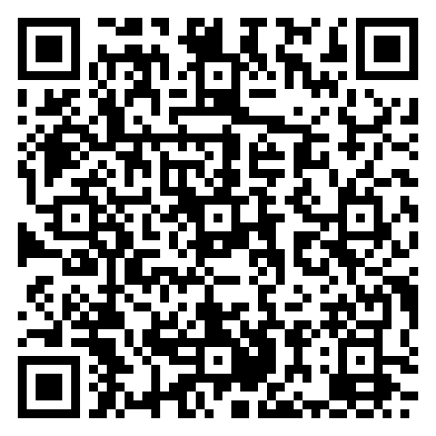

# Stats refresher

### PSYC 11: Laboratory in Psychological Science

Jeremy R. Manning
Dartmouth College
Spring 2026

---

# Today's goals

Quick refresher on the stats concepts you'll need for analyzing experimental data. This is about building **intuitions**, not memorizing formulas.

By the end of this session, you should feel comfortable **choosing the right test** for your data and **interpreting the results**.

Follow along with the [companion notebook](https://colab.research.google.com/github/ContextLab/experimental-psychology/blob/main/notebooks/stats_refresher.ipynb) to see these concepts in action with real (simulated) data. Try running the code yourself and playing with the parameters!

---

<!-- _class: scale-90 -->

# Hypothesis testing

A framework for deciding whether observed data provide evidence against a default assumption (the **null hypothesis**, $H_0$). You compute a **test statistic** from your data and ask: *how surprising is this result if $H_0$ were true?*

1. State a **null hypothesis** ($H_0$): there is no effect, no difference, no relationship
2. Collect data and compute a **test statistic** (e.g., $t$, $F$, $\chi^2$)
3. Compare to the **null distribution** &mdash; the distribution of that statistic if $H_0$ were true
4. Compute a **p-value**: the probability of a result this extreme (or more) under $H_0$

---

# Null distributions

The **null distribution** is the sampling distribution of a test statistic *assuming the null hypothesis is true*. It tells you what values you'd *expect* to see by chance alone.

You flip a coin 100 times and get 60 heads. Your friend says the coin is biased.

- What's the null hypothesis?
- What would the null distribution look like? (Hint: what's the expected number of heads for a fair coin?)
- Is 60/100 surprising enough to reject fairness? What about 55/100? 90/100?
- How would your answer change if you only flipped 10 times and got 6 heads?

---

# P-values

The **p-value** is the probability of observing a result **as extreme as (or more extreme than)** what you actually got, *assuming the null hypothesis is true*. It is **not** the probability that the null hypothesis is true.

- $p = 0.03$ does **not** mean there's a 3% chance $H_0$ is true
- $p = 0.03$ means: *if* there were truly no effect, you'd see a result this extreme only ~3% of the time
- A small $p$ means the data are surprising under $H_0$ &mdash; but surprising doesn't mean impossible, and unsurprising doesn't mean $H_0$ is correct

---

# Effect sizes

A **standardized measure** of how large an effect is, independent of sample size. Common measures include Cohen's $d$ (group differences), $r$ or $r^2$ (correlations), and $\eta^2$ (variance explained in ANOVA).

- A **tiny** effect can be "statistically significant" with a large enough sample
- A **large** effect can be "non-significant" with too few participants
- **Statistical significance** = the effect is probably real
- **Effect size** = the effect is large enough to **matter**
- Always report both!

---

A pharmaceutical company tests a new drug on 500,000 patients. They find it reduces headache duration by an average of 0.3 minutes ($p < 0.0001$, $d = 0.01$).

- Is this result statistically significant? Is it *meaningful*?
- Would you take this drug? Would you prescribe it?
- What if the same drug reduced headache duration by 45 minutes in a study of 12 people ($p = 0.08$, $d = 1.2$)?
- Which study tells you more about whether the drug *works*?

---

# Confidence intervals

A **95% confidence interval** gives a range of plausible values for a population parameter. If you repeated the study many times, about 95% of the resulting CIs would contain the true value.

A 95% CI does **not** mean "there's a 95% probability the true value is in this interval." The true value is fixed &mdash; the interval is the random part. Think of it as: the *procedure* captures the truth 95% of the time.

**Example:** Active recall group scored $M = 77.8$, 95% CI $= [74.4, 81.2]$. This means values between 74.4 and 81.2 are all plausible estimates of the true population mean.

---

# T-test

Compares the means of **two groups** on a continuous outcome. Asks: is the difference between these group means larger than what we'd expect by chance?

- **Independent samples**: two separate groups (e.g., treatment vs. control)
- **Paired samples**: same participants measured twice (e.g., before vs. after)

- Continuous outcome variable
- Observations are independent (within groups)
- Approximately normally distributed (robust to violations with $n > 30$)
- Report: $t$-statistic, degrees of freedom, $p$-value, and **Cohen's $d$**

---

A researcher wants to know if a mindfulness intervention reduces test anxiety.

**Design A:** She recruits 40 students. Half do mindfulness training; half don't. All take an anxiety questionnaire.

**Design B:** She recruits 20 students. They all take the anxiety questionnaire, then do 4 weeks of mindfulness training, then take the questionnaire again.

- Which design uses an independent-samples $t$-test? Which uses paired?
- What are the advantages and disadvantages of each design?
- Design B finds $p = 0.02$, but anxiety dropped by only 1 point on a 50-point scale. What do you conclude?

---

# ANOVA

Compares the means of **three or more groups**. Instead of asking "are these two means different?" it asks "are *any* of these means different from the others?" If significant, follow-up tests (post-hoc) identify *which* groups differ.

- Reports an $F$-statistic and $p$-value
- Effect size: $\eta^2$ (eta-squared) = proportion of total variance explained by group membership
- A significant ANOVA tells you *something* differs, but not *what* &mdash; you need post-hoc tests (e.g., Tukey's HSD) for that
- Extends to multiple factors: two-way ANOVA examines main effects and **interactions**

---

A sleep researcher assigns participants to sleep 4, 6, or 8 hours per night for a week, then measures reaction time. ANOVA yields $F(2, 57) = 12.4$, $p < 0.001$, $\eta^2 = 0.30$.

- What's the null hypothesis?
- We know the groups differ &mdash; but do we know if 4 hours is worse than 6? Or only that 4 is worse than 8?
- $\eta^2 = 0.30$ means sleep duration explains 30% of the variance in reaction time. Is that a lot? What explains the other 70%?
- Could you answer this question with three separate $t$-tests instead? Why is that problematic?

---

# Correlation

Measures the **strength and direction** of the linear relationship between two continuous variables. Pearson's $r$ ranges from $-1$ (perfect negative) through $0$ (no relationship) to $+1$ (perfect positive).

- $r^2$ tells you the proportion of variance shared between the two variables
- Correlation does **not** imply causation &mdash; a lurking third variable could drive both
- Only captures **linear** relationships &mdash; a perfect U-shaped curve would give $r \approx 0$
- Sensitive to outliers: a single extreme point can dramatically inflate or deflate $r$

---

Consider these three findings:

1. Ice cream sales and drowning deaths are positively correlated ($r = 0.85$)
2. A student's shoe size correlates with reading ability ($r = 0.70$) in a sample of kids aged 5--15
3. Countries with more Nobel Prize winners per capita also consume more chocolate per capita ($r = 0.79$)

For each:
- Does the correlation reflect a causal relationship?
- What's the lurking variable?
- How would you design a study to test whether the relationship is causal?

---

# Regression

**Predicts** a continuous outcome from one or more predictor variables. Unlike correlation (which only measures association), regression gives you an **equation**: $\hat{y} = b_0 + b_1 x_1 + b_2 x_2 + \ldots$

Each coefficient ($b$) tells you how much the outcome changes for a one-unit increase in that predictor, **holding all other predictors constant**.

- **Correlation** says: sleep and grades are related ($r = 0.36$)
- **Regression** says: each additional hour of sleep predicts a 4-point increase in exam score, *after controlling for study time and caffeine*
- The $R^2$ value tells you how much variance all predictors *together* explain

---

In our sleep study, regression found:
- Sleep: $\beta = 3.98$ (each extra hour of sleep &rarr; ~4 more exam points)
- Caffeine: $\beta = 0.01$ (essentially zero)

But the *correlation* between caffeine and exam scores is $r = -0.30$.

- Why does caffeine "disappear" in the regression but show up in the correlation?
- What does this tell you about the relationship between caffeine, sleep, and exam scores?
- When would you use correlation vs. regression to answer a research question?

---

# Chi-squared test

Tests whether two **categorical variables** are associated (independent). Compares **observed frequencies** in each cell of a contingency table to the frequencies you'd **expect** if the variables were unrelated.

- Works with categorical data only (not continuous)
- Effect size: **Cram&eacute;r's V** (ranges from 0 to 1)
- Requires expected cell counts $\geq 5$ for validity
- Does **not** tell you the direction of association &mdash; just whether one exists

---

A university surveys 200 students about their preferred study location (library, dorm, caf&eacute;) and their major (STEM, humanities, social science). They find $\chi^2(4) = 15.3$, $p = 0.004$, $V = 0.20$.

- What's the null hypothesis?
- What would the expected frequencies look like if major and location were truly independent?
- The result is significant &mdash; but can we say "STEM students prefer the library"? What additional analysis would we need?
- Could you use a $t$-test here instead? Why or why not?

---

# Binomial test

Tests whether an observed **proportion** differs from a hypothesized value. Used when your outcome is binary (success/failure, yes/no) and you want to know if the success rate differs from chance (or from some other benchmark).

- Does a coin land heads more than 50% of the time?
- Do more than 20% of students pull all-nighters?
- Is a medical test's false-positive rate above the acceptable threshold of 5%?

---

A college claims that 85% of its graduates find employment within 6 months. A skeptical journalist surveys 80 recent graduates and finds that 60 (75%) are employed.

- What's the null hypothesis?
- Is 75% vs. 85% a meaningful difference, or could it be sampling variability?
- The binomial test gives $p = 0.028$. What do you conclude?
- Now imagine a different college claims 50% employment and you observe 44/80 (55%). The binomial test gives $p = 0.43$. Same question: what do you conclude?
- How does sample size affect your ability to detect a difference from the claimed rate?

---

<!-- _class: scale-90 -->

# Choosing the right test

| Your question | Data types | Test | Effect size |
|-|-|-|-|
| Compare 2 group means | 1 categorical (2 levels) + 1 continuous | **$t$-test** | Cohen's $d$ |
| Compare 3+ group means | 1 categorical (3+ levels) + 1 continuous | **ANOVA** | $\eta^2$ |
| Linear association | 2 continuous | **Correlation** | $r$, $r^2$ |
| Predict from multiple vars | Multiple predictors + 1 continuous outcome | **Regression** | $R^2$ |
| Association of categories | 2 categorical | **Chi-squared** | Cram&eacute;r's $V$ |
| Test a proportion | 1 binary | **Binomial test** | Obs. $-$ expected |

---

For each scenario, identify the appropriate test and state the null hypothesis:

1. You want to know if students who sit in the front row score higher than those in the back
2. You're testing whether coffee preference (espresso, drip, cold brew) is related to personality type (introvert vs. extrovert)
3. A teacher measures test scores before and after switching to a new textbook, for the same 30 students
4. You want to predict final exam score from GPA, attendance rate, and hours of sleep
5. In a sample of 50 coin flips by a magician, 34 land on heads

*Discuss with a partner, then we'll share.*

---

# Questions? Want to chat more?

  

    &#x1F4E7;
    <a href="mailto:jeremy@dartmouth.edu">Email</a> me
  

  

    &#x1F4AC;
    Join our <a href="https://psyc11.slack.com">Slack</a>
  

  

    &#x1F481;
    Come to <a href="https://context-lab.com/scheduler">office hours</a>
  

- **Friday**: analyze the drawing lab data using these techniques
- Try out the  to see each test in action on real (simulated) data

