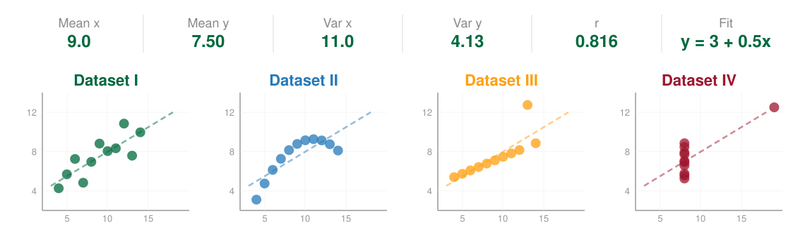
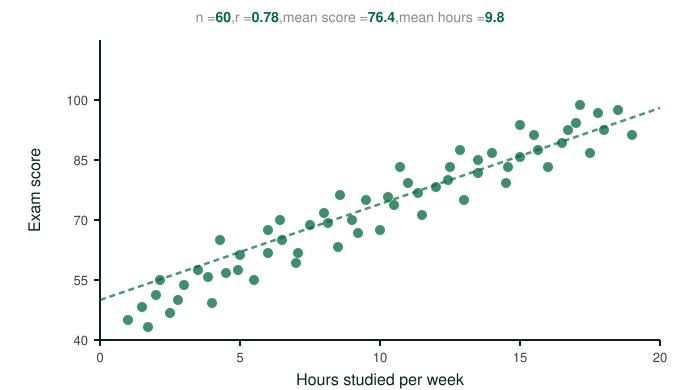
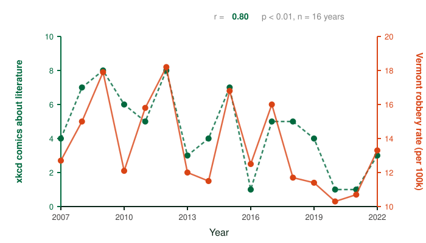

# Exploring and understanding data

### PSYC 11: Laboratory in Psychological Science

Jeremy R. Manning
Dartmouth College
Spring 2026

---

# Truth and data

- The "universe" produces data
- Math doesn't lie&mdash; but **analyses** involve choices
- Different analyses can lead to different conclusions
- The same dataset can tell very different stories

---

# What patterns should you look for?

- **Shape:** How many observations? How many features? Any missing data?
- **Distributions:** Are values clustered? Spread out? Skewed?
- **Relationships:** Do any features move together? In opposite directions?
- **Outliers:** Are there values that seem "wrong" or surprising?

---

<!-- _class: scale-90 -->

# The power of visualization

- Tables of numbers hide patterns; plots reveal them
- Always look at your data **before** running statistics
- Anscombe's quartet (below): four datasets with **identical** means, variances, correlations, and regression lines &mdash; but completely different stories

---

<!-- _class: scale-90 -->

# Discussion: what does this graph tell you?

A psychology professor surveyed 60 of her PSYC 6 students about their study habits and recorded their midterm exam scores. She fit a regression line to the data:

- What **story** does this plot tell?
- What is it **not** telling you? What would you want to know before believing the "more studying &rarr; higher scores" story?
- What follow-up plot or analysis would you want to see next?

---

<!-- _class: scale-90 -->

# Discussion: how about this one?

The number of xkcd comics published about literature is strongly positively correlated with the robbery rate in Vermont (2007&ndash;2022).

- What **story** does this plot tell?
- What is it **not** telling you? What would you want to know before believing the "more xkcd literature comics &rarr; more robberies" in Vermont story?
- What follow-up plot or analysis would you want to see next?

---

<!-- _class: scale-90 -->

# Discussion: how about this one?

The number of xkcd comics published about literature is strongly positively correlated with the robbery rate in Vermont (2007&ndash;2022).

*"As xkcd published more literature comics, book enthusiasts flocked to Vermont. Caught up in literary intrigue, they sparked a wave of daring heists &mdash; leaving authorities to wonder why Shakespeare and Hemingway inspired the crime spike."*

---

# Analytic flexibility

- There are typically many ways to analyze data
- Different choices (which subset, which test, which visualization) can lead to different conclusions
- This is why **transparency** about your analysis choices matters

---

# What's in your toolkit?

- Observation, intuition, and logic
- Simple summaries (mean, standard deviation, sorting)
- Traditional statistical tests (t-tests, correlations, ANOVAs)
- Fancier methods and simulations

---

# Getting help

- Teaching staff (instructor + TAs)
- Other students
- Slack (`#stats-stuff`, `#data-sleuthing-lab`)
- Google, Stack Exchange, Wikipedia, ChatGPT/Claude/[chat.dartmouth](https://chat.dartmouth.edu)

---

# Questions? Want to chat more?

  

    &#x1F4E7;
    <a href="mailto:jeremy@dartmouth.edu">Email</a> me
  

  

    &#x1F4AC;
    Join our <a href="https://psyc11.slack.com">Slack</a>
  

  

    &#x1F481;
    Come to <a href="https://context-lab.com/scheduler">office hours</a>
  

- **Friday**: Part 3 of the lab (more analysis, discussion)

