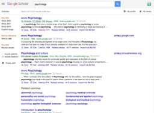
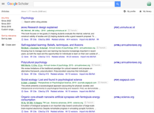

# Searching and reviewing the relevant scientific literature

### PSYC 11: Laboratory in Psychological Science

Jeremy R. Manning
Dartmouth College
Spring 2026

---

# What's the point of doing science?

- Satisfy our curiosity
- Make stuff
- Contribute to human knowledge

---

# Think about which you'd expect to be more impactful:

- A "perfect" study carried out in secret, never shared
- A "good" study carried out in public, widely discussed, peer reviewed, published

---

# Contributing requires sharing

- When you do your own science, **you** can benefit
- **Others** only benefit if you share what you learned or found

---

# Sharing improves efficiency

- Consider everything we know, as a species
- How long did it take us to acquire that knowledge?
- How long would it take you to re-derive that knowledge?

---

# Contextualizing improves impact

- Scenario 1: we found something interesting! It's unrelated to anything people have done before.
- Scenario 2: we found something interesting! Here's how it fits in with other things you might know or care about.

---

# The "Discussion" section

- Summarize what you did and what you found
- Describe how your work **fits in with the broader literature**
- Describe what you think the **next steps** are

---

# The "Discussion" section

- Writing a good discussion section requires mining the literature for relevant material

---

# Where can you find relevant articles

- Old: go to a library and physically move papers around
- New: Google Scholar, Semantic Scholar

---

# Google scholar

---

# Google scholar

---

# How to (very quickly) skim an article

- Read the title
- Skim the abstract
- Quickly look up key terms as needed
- Skip everything else
- Target: 30 seconds -- 2 minutes

---

# How to (quickly) read an article

- Read the title
- Read the abstract
- Skim the introduction
- Look at the figures:
  - Read the captions, paper text as needed
- Skim the discussion section as needed
- Target: 5 minutes

---

# How to (deeply) read an article

- First pass: Read from top to bottom; highlight any key points or questions as you go
- Second pass: Focus on methods
  - Make sure you understand every sentence; if not, write down questions
- Third pass: focus on results:
  - Make sure you understand every figure; if not, write down questions
- Briefly summarize the main point and key findings
- Now re-read a final time to verify you've understood everything
- Target: several hours (or more)

---

# What's the appropriate reading depth?

- If a paper is tangential to your main point, very quickly skim (10--50 papers)
- If the paper is moderately related to your main point, read it quickly (5--10 papers)
- If the paper is central to your study, read in depth (1--3 papers)

---

# This week's lab: literature search and discussion

- Find a "template" paper and several related papers
- Re-factor the template's discussion section, taking the other papers into account

---

# This week's lab: literature search and discussion

