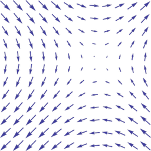

# Synthesizing across studies (and findings)

### PSYC 11: Laboratory in Psychological Science

Jeremy R. Manning
Dartmouth College
Spring 2026

---

# How can we know the "direction" of a field?

---

# How do we guess at "truth"?

- When many studies **agree**, our confidence in them increases
- When studies **disagree**, how can we know which is right?

---

# Strategies

- Occam's razor
- Look for hidden "logic gaps"
- Create a narrative
- Trust your intuitions

---

# Occam's razor

- William of Ockham (13th century philosopher): "pluralitas non est ponenda sine necessitate" -- plurality should not be posited without necessity
- Given two alternatives that explain the data similarly well, prefer the simpler explanation
- Extraordinary claims require extraordinary evidence

---

# Logic gaps

- Think about mathematical proofs-- each step starts exactly where the prior step left off
- When we use imprecise (non-quantitative) language, gaps between "steps" can be harder to notice
- When gaps exist, they reflect potential challenges for an explanation

---

# Creating a narrative

- Think about how you'd tell someone about the phenomenon you're studying
- What key elements of the story do you need? Background/motivation, connect key "plot points" into a cohesive logically sound story, conclude with a clear message, etc.

---

# Trust your intuitions

- If your story doesn't make sense to **you**, then it won't make sense to others either
- If your interpretations could go in multiple directions, think about what you'd **guess** is most likely
- Be open and honest about limitations: what should your audience trust vs. what is only speculation?

---

# Examples

- High-impact factor articles (in Nature, Science, PNAS, etc.) are often well-written for a (relatively) broad audience
- Long-format journal articles (Psych Review, JEP: General, etc.) often go into substantially more depth than typical articles
- Review papers, opinion papers, and book chapters are kind of like "extended" discussion sections (TICS, Nature Reviews Neuroscience, Current Opinions, edited volumes)
