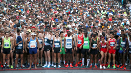

# Final project: getting started

### PSYC 11: Laboratory in Psychological Science

Jeremy R. Manning
Dartmouth College
Spring 2026

---

# Approximate schedule

- **This week:** find a group, design your study, start implementing/building
- **Week 7:** human subjects training, collect data
- **Week 8:** analyze data
- **Week 9:** interpreting results + public poster presentation
- **Week 10:** wrap-up (paper and final poster)

---

# Slack setup

- Create a channel for your group (bonus points for a creative team name!)
- Invite all group members + TA + me
- Use the channel to brainstorm ideas, share documents and data, ask for project-specific help, etc.

---

# Rest of today: pitches!

