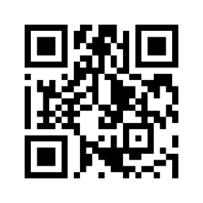
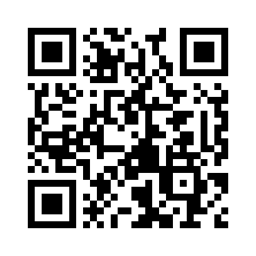
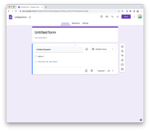
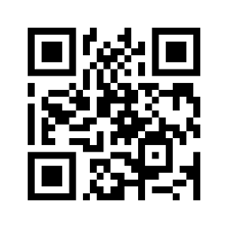
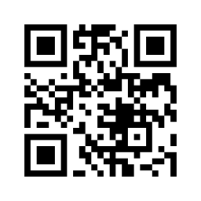

# Quick-start guide to experimental design

### PSYC 11: Laboratory in Psychological Science

Jeremy R. Manning
Dartmouth College
Spring 2026

---

# What is the purpose of running an experiment?

- Understand or explore how something works
- Distinguish between several potential alternatives
- Get more information (data!)

---

# What "counts" as an experiment?

- Observing something happening without manipulating it
- Self-reflection or self-report
- Constructing a scenario in which the process you want to study occurs
- Running a simulation (via real-life or computation)

---

# Observational studies

- Prime directive: do not interfere
- Go out into the world and collect data
- Examples:
  - Studying an animal colony
  - Watch how people interact at a party
  - Record facial expressions as people enter and exit a movie screening
  - Measure highway traffic density at different times of day

---

# Self-report

- Socrates: "To know thyself is the beginning of wisdom"
- Trust people to accurately report their opinions, thoughts, feelings, and behaviors
- Examples:
  - Voter preference/opinion surveys
  - Mental health screening forms
  - Feedback surveys
  - Personal narratives

---

# Constructed scenarios

- In general, there are two widely used approaches:
  - Classic: maximize **control**
  - Naturalistic: maximize **realism**

---

# Classic experiments

- Figure out the simplest possible version of the process or phenomenon you're interested in
- If you think the process depends on participants' experiences (e.g., stimuli, framing, effort, etc.), carefully control those factors across several conditions
- Use behaviors (across conditions if needed) as a stand-in for the "real thing"

---

# Classic experiments: examples

- Vision: can you see this tiny spot of light?
- Audition: what word do you hear when I play this sound?
- Memory: which images in this set do you recognize?
- Cognitive control: how tightly can you regulate your responses to a cue?

---

# Naturalistic experiments

- Create a scenario that closely approximates the real-world process you want to study
- Measure as much stuff as possible about people's behaviors
- Mine the data for patterns

---

# Naturalistic experiments: examples

- Vision: where do you fixate at each moment while moving around in a VR environment?
- Memory: how you describe "what happened" in a movie?
- Motor control: how do people adjust their gait on different terrains?

---

# Simulations

- Real-world: use props, actors, and technology to make it seem like the participant is in a particular situation, or that the world works a particular way
- Simulated: change the properties of a simulated environment and study an artificial agent's behaviors

---

# Simulations: examples

- Confederate experiments
- Misleading participants about the situation or rules
- Simulating how robots of different configurations complete obstacle courses under different gravitational loads

---

# Implementation tools

- Notebooks, audiovisual recordings
- Google forms, qualtrics
- Slideshows
- PsychoPy, jsPsych
- Google Colaboratory

---

# Notebooks and recordings

- Good for observational studies
- Collect lots of richly structured data!
- No setup required!
- Can be tough to analyze (either time-consuming to annotate, or tricky to design effective automated approaches)

---

# Google forms and qualtrics

 

---

# Slideshows

---

# PsychoPy

---

# jsPsych

---

# Other considerations

- Use what you already know
- Simplicity: the art of maximizing the amount of work **not** done
- Work together
- Ask for help
