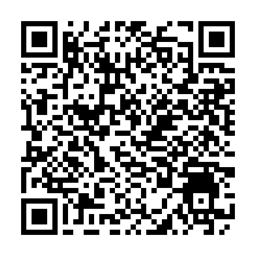
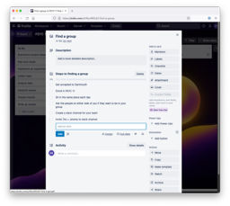
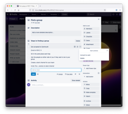
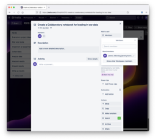
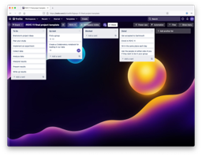

# Project management

### PSYC 11: Laboratory in Psychological Science

Jeremy R. Manning
Dartmouth College
Spring 2026

---

# Staying on track

- When big team deadlines are far away, how can you know if you are on track?
- Break down your big tasks into smaller tasks and set interim deadlines
- Define points of accountability
- Use frequent updates and audits

---

# How do you decide what to work on "next"?

- Think: weekly snippets!
- What have I **already done**?
- What are the **next milestones**?
- Is there anything I'm **stuck on**?

---

# Key milestones

- :check_mark: Find a group (ideal: 3ish students)
- :check_mark: Brainstorm project ideas
- :arrow_right: Plan your study
- :arrow_right: Implement an experiment
- Collect data
- Analyze data
- Interpret, present, and write up results

---

# Project boards

---

# Project boards

---

# Project boards

---

# Accountability

---

# Status overview

---

# Other tips and tricks

- Tasks are associated with **products** -- a task isn't "done" until you have something tangible to show for it
- When you accept/assign a task, make sure it's clear what that task's product will be
- Life happens-- communicate with your team if expectations shift
