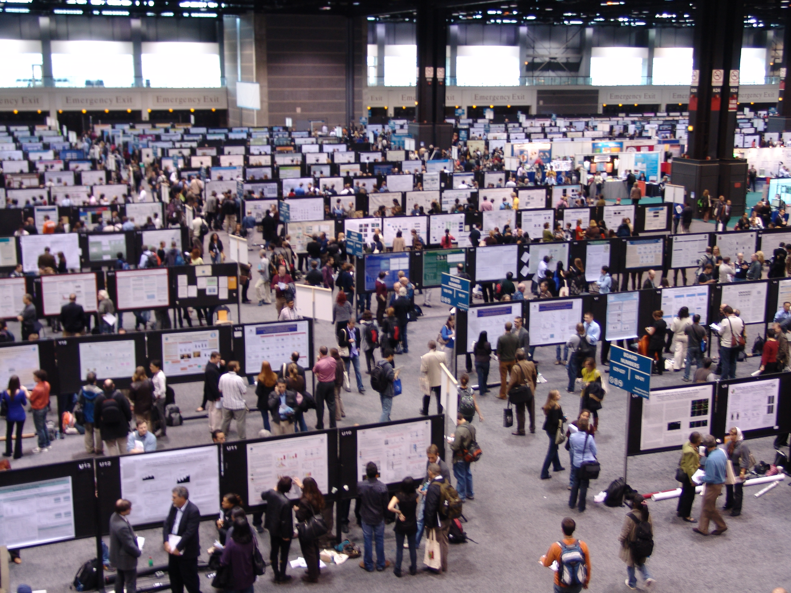
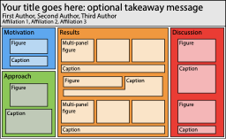
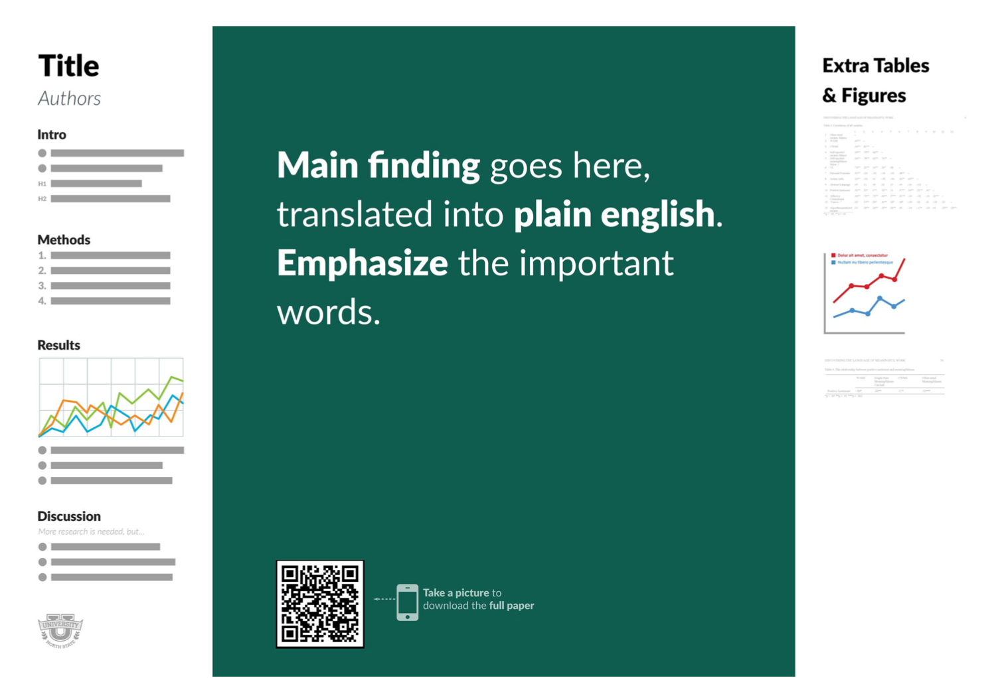
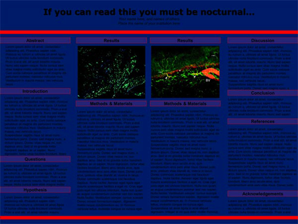
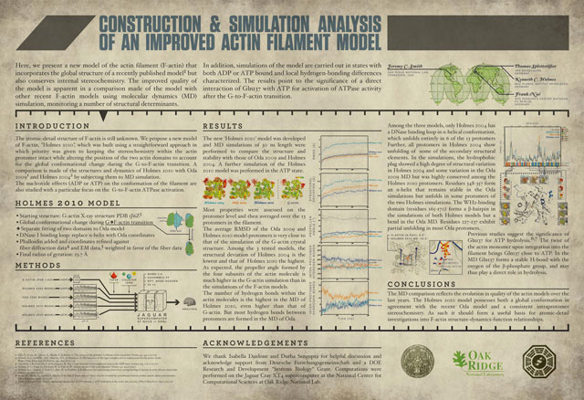

# Introduction to poster presentations

### PSYC 11: Laboratory in Psychological Science

Jeremy R. Manning
Dartmouth College
Spring 2026

---

# What is a poster presentation?

---

# Anatomy of a poster

---

# Information bar

- Provide a quick (one-line) summary of the work
- Tell people **who** did the work
- Tell people **where** the work was done

---

# Motivation

- Summarize why the work is interesting
- Introduce your question
- Provide some sort of graphical depiction of your study/question

---

# Approach

- Describe how you studied your question (experiment and analyses)
- Include major methods details
- Include one or more figures

---

# Results

- Show what you **found**
- Tell a **story**
- Focus on the most critical stuff
- As space allows, include other details to supplement your narrative

---

# Discussion

- Show what your findings **mean**
- Situate your work within the context of the broader literature
- Suggest future directions for your work

---

# Optional stuff

- Bibliography
- An (explicit) "conclusions" section
- Separate "experimental methods" from "analytic methods"
- Group results in some way

---

# Another approach...

---

# Guiding principles

- Less (text) is more. **Show, don't tell.**
- A poster does not need to be self-contained. **It's a visual aid, not a tour guide.**
- Keep your poster **visually clean and appealing**. Think about: efficient use of space, font size, consistency, and alignment.
- Think about audience traffic flow and management.

---

# Examples...

---

# Example: Pigs in space

---

# Example: Nocturnal poster

---

# Example: Actin filament model

---

# Example: Global variance impacts search

---

# Example: Broadband shifts in EEG

---

# Example: Topographic Factor Analysis

---

# Example: Directed forgetting

---

# Example: Efficient learning

---

# Example: Mapping experience and recall

---

<!-- _class: scale-90 -->

# How do you "make" a poster?

- **Option 1:** Slide presentation software (PowerPoint, Keynote, OpenOffice, Google Slides)
- **Option 2:** Vector graphic software (Adobe Illustrator, Inkscape, Sigma)
- **Option 3:** Text processing (LaTeX Beamer, RMarkdown)

- Paste in figures (vectors or 300+ DPI)
- Draw your own diagrams
- Use existing "open" graphics (vecteezy, freevector, Wikipedia, Google image search)
- Use GenAI (review carefully for accuracy, visual "glitches")

---

# Printing your poster

- Dimensions: 36" by 50" (or smaller)
- Use the PBS poster printer (second floor, Moore Hall)
- Print at Kinkos/FedEx/Staples. This will cost around $100. Useful for "last minute" jobs.

---

# Presenting your poster

- Duration: 3--5 minutes (**practice!**)
- You'll be interrupted **a lot**!
- Try to anticipate questions.
- If/when you don't know something, just say "**I don't know**." Be polite and respectful. Don't get defensive.
- If all else fails, use the "**smile trick**."

---

# What should you submit?

- **One submission per group**. Everyone gets the same grade.
- Document listing all of your group members
- PDF of your poster
- Link to a **YouTube video** of your poster presentation (should be public; can be unlisted)

