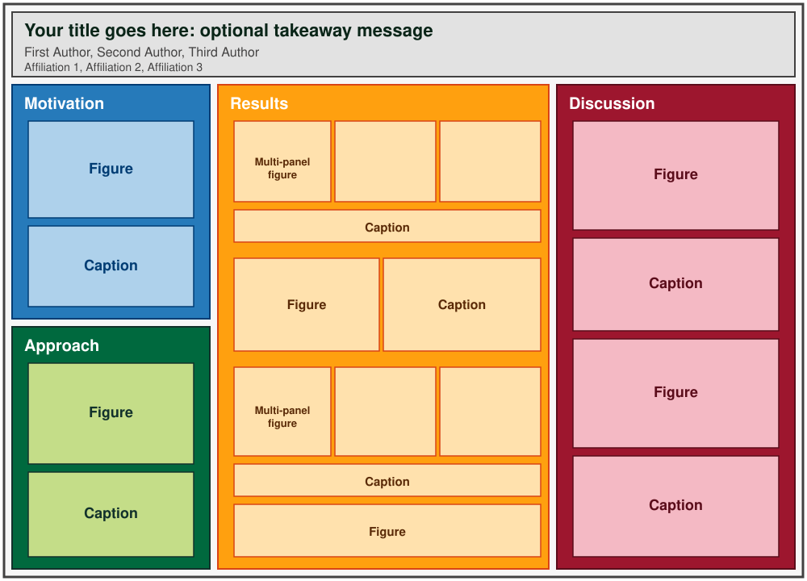
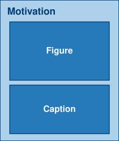
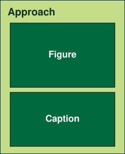
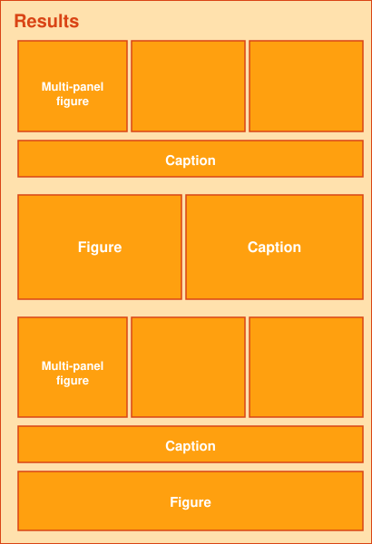
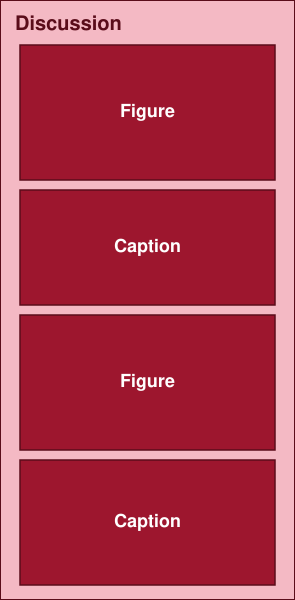
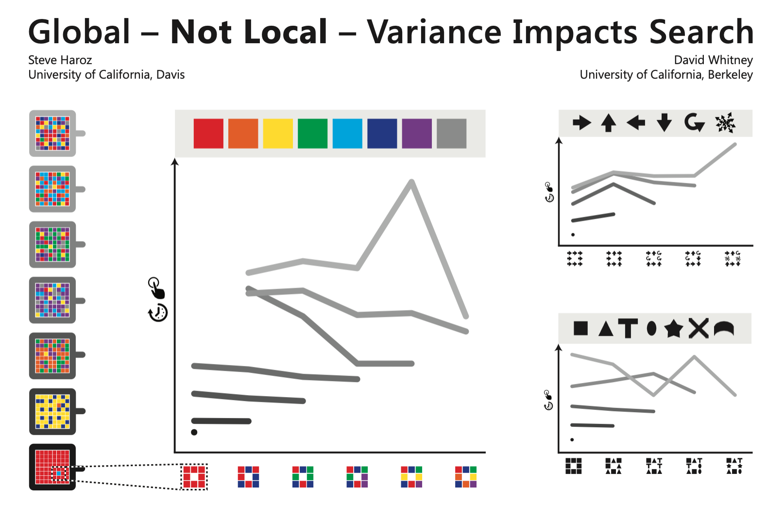
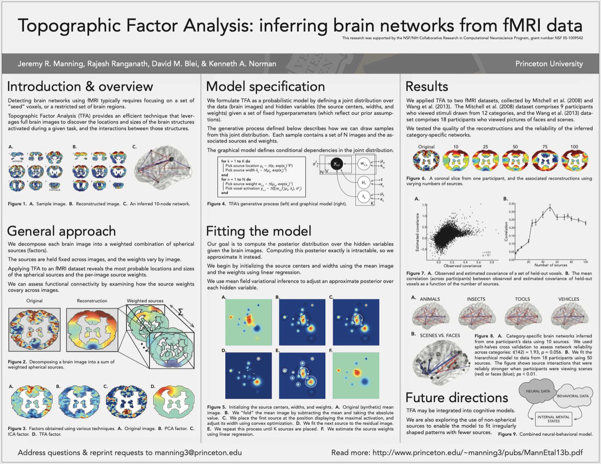
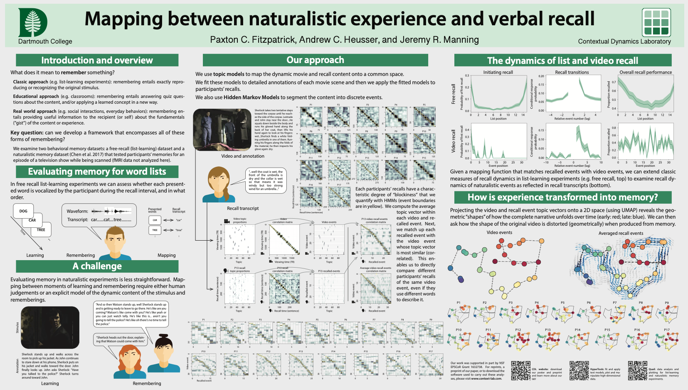
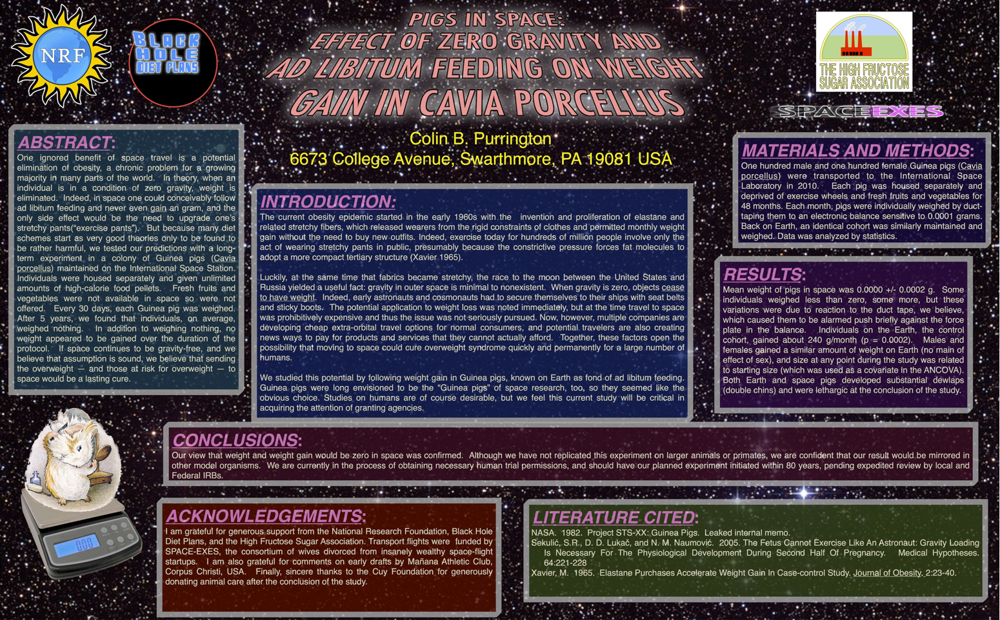

# Introduction to poster presentations

### PSYC 11: Laboratory in Psychological Science

Jeremy R. Manning
Dartmouth College
Spring 2026

---

# What is a poster presentation?

- A **visual summary** of your research, designed to be read in 3&ndash;5 minutes
- You stand next to it and **talk people through** your work
- It's a **visual aid**, not a self-contained document &mdash; *you* are the presentation

By the end of a poster session, your goal is for people to walk away knowing (a) what you did, (b) what you found, and (c) why it matters.

---

# Anatomy of a poster

---

# Information bar

- **Quickly orient** your audience &mdash; a short, clear **title**, with an optional one-line takeaway message after a colon
- **Who** did the work (author list) and **where** it was done (affiliations)
- Sometimes: contact info or a QR code linking to the full paper

---

# Motivation

- **Why is this interesting?**
- What is your **specific question**?
- A **graphical depiction** of the question or setup &mdash; an image is worth more than a paragraph
- Keep it tight: this section sets up everything else

---

# Approach

- **How did you study** the question?
- Major experiment and analysis details &mdash; *not* every detail, just enough that someone could understand and (roughly) replicate
- One or more **figures**: experimental paradigm, analysis pipeline, etc.

---

# Results

- **What did you find?**
- Tell a **story**: order the figures so each one builds on the last
- Focus on the **most critical** findings &mdash; you can leave secondary results out
- **Every figure** needs a self-contained caption: a reader should understand it without reading any surrounding text

---

# Discussion

- **What does it mean?**
- Situate your work within the **broader literature**
- Suggest **future directions**
- Be honest about **limitations** &mdash; what *can't* you conclude from this study?

---

# Optional sections and alternative formats

- **Bibliography:** key references (often in tiny font at the bottom)
- **Conclusions:** explicit takeaways, separate from the discussion
- **Methods:** separate "experimental methods" from "analytic methods" if both are nontrivial
- **Acknowledgments:** funding sources, collaborators

A different layout: one *huge* takeaway message in the center, with supporting details in narrow side columns. Works well for posters with a single dramatic result. Best when you want passersby to grasp your finding in **5 seconds**.

---

# Guiding principles

- **Show, don't tell.** Your poster is a visual aid, not a paper on a wall
- **Visual hierarchy** guides the reader's eye: titles big, body text smaller but still readable
- **Font sizes:** title 72pt+, section headers 36pt+, body text 24pt+ (readable from 4 feet away)
- **White space** matters &mdash; it makes your poster feel clean and approachable
- **Consistency and alignment** &mdash; aligned elements feel deliberate, misaligned ones feel sloppy

---

<!-- _class: scale-90 -->

# Common mistakes

- **Too much text** &mdash; if your poster looks like a paper, you have too much text
- **Tiny fonts** &mdash; if you can't read it from 4 feet away, it's too small
- **No visual hierarchy** &mdash; everything looks equally important
- **Unlabeled figures** &mdash; no axes, no legends, no captions
- **Walls of numbers** &mdash; tables of raw statistics without interpretation
- **Cluttered layout** &mdash; no white space, sections crammed together
- **Vague title** &mdash; "An investigation of X" tells the reader nothing

---

<!-- _class: scale-80 -->

# Examples: what works

<em>Almost no text. The figures tell the whole story.</em>

<em>Clean grid, clear sections, balanced text and figures.</em>

<em>Modern, lots of white space, story-driven figures.</em>

---

<!-- _class: scale-80 -->

# Examples: what to avoid

- What stands out as **bad** about this poster?
- If you were walking by, would you stop?
- What would you **change first**?
- (This poster is intentionally awful &mdash; it's from a "how not to make a poster" guide by Colin Purrington.)

---

<!-- _class: scale-80 -->

# How do you "make" a poster?

- **Slide software:** PowerPoint, Keynote, Google Slides (set custom slide size to 36" &times; 50")
- **Vector graphics:** Adobe Illustrator, Inkscape, Figma
- **Text processing:** LaTeX Beamer poster templates, RMarkdown / Quarto
- Use **vectors** or **300+ DPI** images so the printed poster looks crisp

You can ask Claude, ChatGPT, Gemini, etc. to help with poster design &mdash; layouts, color schemes, even draft text. Use it for **style and structure**, but write the actual content yourself and **review for accuracy** (AI loves to hallucinate plausible-sounding facts).

- **Dimensions:** 36" &times; 50" (or smaller) for our session
- **Where to print:** PBS poster printer (2nd floor, Moore Hall) or Kinkos/FedEx/Staples (~$100)

---

# Presenting and submitting

- Practice your talk: aim for **3&ndash;5 minutes**
- You will be **interrupted** &mdash; that's normal and good
- If someone asks something you don't know, just say "**I don't know**" &mdash; politely. Don't get defensive
- Try to anticipate likely questions and prepare brief answers

- **PDF** of your poster
- Link to a **YouTube video** of your group presenting the poster (can be unlisted)
- **Final paper**
- **Group contribution statements**

---

# Today's goal: design your analyses

- **Data collection** can happen any time outside of class &mdash; you don't need us for that
- **In class**, focus on what's harder to do alone: **designing the analyses** that will go into your poster and paper
- For each question your study addresses: what test? what figure? what would the result tell you?

We're here in class specifically to help you think through analysis design &mdash; come find us and tell us what you're planning.

---

# Questions? Want to chat more?

  

    &#x1F4E7;
    <a href="mailto:jeremy@dartmouth.edu">Email</a> me
  

  

    &#x1F4AC;
    Join our <a href="https://psyc11.slack.com">Slack</a>
  

  

    &#x1F481;
    Come to <a href="https://context-lab.com/scheduler">office hours</a>
  

- **This week:** continue analysis work; start sketching your poster
- **Friday:** writing your final paper
- **Next week:** instructor away &mdash; TAs available for help
- **June 1:** project wrap-up
- **June 3:** public poster session + all final deliverables due

